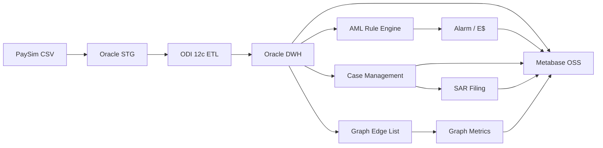

# AML Smurfing Detection — Data Warehouse & BI

**End-to-end Data Warehouse & Business Intelligence project built with Oracle 19c, ODI 12c and Metabase OSS.**

A production-oriented AML analytics platform designed around **6.36M+ financial transactions**, combining dimensional modeling, ETL, SCD Type 2, data quality, rule-based analytics, network analysis and operational BI.

> **Business problem:** Detect suspicious transaction patterns and transform them into an analyzable and operational workflow from **transaction → alarm → case → SAR → BI reporting**.

---

## 📊 Project at a Glance

| Metric | Result |
|---|---:|
| Financial Transactions | **6,362,620** |
| Active Accounts | **9,073,900** |
| AML Typologies | **6** |
| Cases | **3,508** |
| SAR Filings | **175** |
| DQ Checks | **11 / 11 PASS** |
| Smurfing Test Precision | **100%** |

### Core Technology

`Oracle 19c` · `ODI 12c` · `SQL` · `PaySim` · `Metabase OSS` · `Docker` · `Git/GitHub`

---

## Architecture

## What I Built

### 1. Data Warehouse

- Oracle 19c üzerinde star-schema tabanlı DWH
- 7 dimension
- 4 fact
- `DIM_HESAP` ve `DIM_MUSTERI` üzerinde SCD Type 2
- Surrogate key yaklaşımı
- Foreign key ilişkileri
- 
2. ETL with ODI 12c

Built the ETL flow using Oracle Data Integrator 12c.

The pipeline covers:

PaySim CSV
    ↓
Staging
    ↓
ODI ETL
    ↓
CKM validation / AML rules
    ↓
Data Warehouse
    ↓
BI / Analytics

ODI was used for data movement, mappings, lookups, integration and CKM-based validation.

📌 ODI Designer project export:

odi-exports/

🚨 AML Rule Engine

Six AML typologies were implemented at the Oracle / ODI CKM layer.

Smurfing

Detects cases where:

multiple distinct senders
transfer money to the same target account
within a 24-hour window
followed by a short-time outgoing transaction

The scoring result is exposed through:

STG_AML.SMURFING_SCORE_VW
Structuring

Detects repeated transactions below a defined threshold within a 24-hour window.

STG_AML.STRUCTURING_SCORE_VW
Layering

Analyzes multi-hop transfer chains using recursive transfer analysis.

STG_AML.LAYERING_SCORE_VW
Round Trip

Identifies transaction paths returning to the originating account.

A → B → ... → A
Dormant Account Reactivation

Detects significant transactions following long periods of account inactivity.

Round Amount

Identifies high-value round-number transactions used as an additional risk signal.

🕸️ Network Risk Analysis

Transaction relationships were transformed into a graph-oriented analytical layer.

GRAPH_EDGE_LIST

Represents account-to-account transaction relationships.

GRAPH_METRICS

Calculates:

incoming connection count
outgoing connection count

for active accounts.

The graph layer allows suspicious accounts to be evaluated together with their surrounding transaction network rather than only as isolated transactions.

Gephi was intentionally excluded from the final architecture. Network analysis is handled through the Oracle graph layer and Metabase reporting.

🗂️ Operational AML Workflow

The project does not stop at detecting suspicious transactions.

The operational flow is:

Transaction
     ↓
AML Rule
     ↓
Alarm
     ↓
FACT_CASE
     ↓
Case Investigation
     ↓
SAR Filing
Case distribution
Status	Cases
ACIK	2,283
INCELEMEDE	700
KAPALI	350
SAR_GONDERILDI	175
SAR validation
175 SAR records
175 distinct cases
1,581,043,000 total related amount
0 orphan cases
0 case/SAR mismatch
📈 Model Performance

Real DWH output:

Metric	Result
Total Alerts	3,508
True Positives	287
False Positives	3,221
Recall	3.49%
Precision	8.18%

The result was deliberately reported without artificially improving the metrics.

The high false-positive rate highlights the need for further AML threshold tuning and feature engineering.

🧪 Synthetic Validation

A controlled Smurfing scenario was injected to validate the rule engine.

Test scenario
6 distinct sender accounts
5,000 per sender
same target account
transactions within a 24-hour window
short-time outgoing transaction
Result

Smurfing pattern detected successfully.

Precision:     100%
False Positive: 0

After validation, synthetic records were removed and the baseline dataset was restored.

✅ Data Quality & Audit

Data quality and ETL monitoring were implemented through:

DWH_AML.DQ_LOG
DWH_AML.ETL_AUDIT_LOG

Validation coverage includes:

orphan keys
duplicate business keys
null checks
row counts
referential integrity
graph integrity
case/SAR consistency
ETL execution status

Final validation:

11 / 11 DQ checks PASS

🔐 KVKK / Data Masking

A masked BI view was created to prevent raw account identifiers from being unnecessarily exposed to BI users.

DWH_AML.DIM_HESAP_MASKELI_VW

Example:

C170123456379
      ↓
C17*******379

The BI layer is designed to use the masked representation whenever raw account identifiers are not required.

📸 BI Dashboards

Built dashboards in Metabase OSS for different operational perspectives:

AML - Uyum

Compliance-focused monitoring.

AML - Risk

Risk and suspicious activity analysis.

AML - Şube

Branch-level analytical view.

Model Performance

Monitoring of alert volume, true positives, false positives, recall and precision.

Dashboard screenshots:

metabase/screenshots/

🧠 Technical Challenges
SCD Type 2

Maintaining historical account states while preserving a current active record.

Large-volume SQL

Working with more than 6.36M transactions in the staging layer.

Recursive Transfer Analysis

Following multi-hop transaction chains for layering detection.

Rule Validation

Creating controlled synthetic scenarios to verify that AML rules detect the intended behavioral pattern.

Data Quality

Validating fact/dimension relationships and preventing orphan records from propagating into analytical layers.

CDC / Journalizing

ODI Journalizing was explored as an advanced option. Because PaySim is a static file-based source, a real source CDC scenario does not exist in this project, so CDC was intentionally excluded from the main production flow.

📁 Repository Structure
aml-smurfing-detection/
│
├── README.md
│
├── docs/
│   ├── PORTFOLIO_CHECKLIST.md
│   └── architecture/
│       ├── architecture.mmd
│       └── Architecture.png
│
├── metabase/
│   └── screenshots/
│
├── odi-exports/
│
└── sql/
    ├── dimensions/
    ├── facts/
    ├── rules/
    ├── graph/
    ├── dq/
    ├── masking/
    ├── monitoring/
    └── workflow/
🗃️ SQL Organization

The SQL layer is separated by responsibility:

sql/
├── dimensions/     → Dimension definitions / SCD
├── facts/          → Fact loading logic
├── rules/          → AML rule logic
├── graph/          → Graph metrics / validation
├── dq/             → Data quality checks
├── masking/        → BI masking
├── monitoring/     → Performance / operational monitoring
└── workflow/       → Case / SAR analytical queries

This structure keeps business rules, warehouse loading logic and monitoring queries separated.

🔮 Future Improvements

Potential next steps include:

AML threshold tuning
false-positive reduction
additional feature engineering
real KYC/customer source integration
real-time CDC source
advanced graph centrality / community detection
model drift monitoring
hybrid rule + ML detection
risk-based case prioritization
📚 Portfolio Evidence

The repository contains real outputs from the development environment:

ODI Designer project XML export
Architecture diagram
Metabase dashboard screenshots
SQL implementation and validation scripts

No fabricated screenshots or placeholder tool exports are used.

🎯 Project Outcome

This project demonstrates an end-to-end Data Warehouse & Business Intelligence architecture built around a real-world analytical problem.

It combines:

Data Engineering

Oracle · ODI · ETL · SQL

Data Warehousing

Star Schema · Fact/Dimension Modeling · SCD Type 2

Analytics

AML Rules · Graph Analysis · Performance Metrics

Data Governance

Data Quality · ETL Audit · Data Masking

Business Intelligence

Metabase · Operational Dashboards

The key objective was not simply to identify suspicious transactions, but to build an analytical platform capable of carrying the data through the complete lifecycle:

Transaction → Detection → Alarm → Case → SAR → BI
